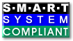

## News 

- `2025-06-01`: **We moved smartmontools from [SourceForge svn](https://sourceforge.net/p/smartmontools/code/HEAD/tree/trunk/) to [GitHub](https://github.com/smartmontools/smartmontools/tree/main).**
- **Information in this Wiki has not yet been updated to reflect this change.**
- `2025-04-30`: **We released [version 7.5 of Smartmontools](https://github.com/smartmontools/smartmontools/releases/tag/RELEASE_7_5). See the [NEWS](https://github.com/smartmontools/smartmontools/blob/RELEASE_7_5/NEWS) file and the [ticket report](https://github.com/smartmontools/smartmontools/issues) to get a summary of the changes and new features.**
- `2025-02-24`: **[Alexander Shaduri](https://shaduri.dev/) released [version 2.0.2 of GSmartControl](https://github.com/ashaduri/gsmartcontrol/releases/tag/v2.0.2) (a graphical user interface for smartctl).**
- `2024-11-26`: [Alexander Shaduri](https://shaduri.dev/) released [version 2.0.1 of GSmartControl](https://github.com/ashaduri/gsmartcontrol/releases/tag/v2.0.1) (a graphical user interface for smartctl).
- `2024-01-03`: Project Trac and Wiki upgraded to the [latest 1.6 version](https://github.com/smartmontools/trac-tickets-archive/issues/1196).
- `2023-09-16`: The CI builds at [builds.smartmontools.org](https://builds.smartmontools.org) are now reproducible if the same [SOURCE_DATE_EPOCH](https://reproducible-builds.org/docs/source-date-epoch/), build recipes and toolchains are used.
- `2023-08-01`: We released [version 7.4 of Smartmontools](https://sourceforge.net/projects/smartmontools/files/smartmontools/7.4/).
- `2023-06-30`: CI builds ([builds.smartmontools.org](https://builds.smartmontools.org)) for macOS now support arm64 and x86_64 architectures, i386 requires build from source. This will also be the case for future release builds.
- `2022-10-10`: **20th anniversary** of [smartmontools first release](https://github.com/smartmontools/smartmontools/commit/d901f4d73a21dfb234aa02746bd9157e99c049af) - see also [smartmontools history](history.md).
- `2022-02-28`: We released [version 7.3 of Smartmontools](https://sourceforge.net/projects/smartmontools/files/smartmontools/7.3/).
- `2022-02-04`: Alexander Shaduri released [version 1.1.4 of GSmartControl](https://github.com/ashaduri/gsmartcontrol/releases/tag/v1.1.4) (a graphical user interface for smartctl).
- `2021-10-23`: **There is a security issue if `smartd` is used conjunction with GNU mailutils < 3.13. See ticket [#1535](https://github.com/smartmontools/trac-tickets-archive/issues/1312) for details and various possible fixes.**
- `2020-12-30`: We released [version 7.2 of Smartmontools](https://sourceforge.net/projects/smartmontools/files/smartmontools/7.2/).
- `2019-12-30`: We released [version 7.1 of Smartmontools](https://sourceforge.net/projects/smartmontools/files/smartmontools/7.1/).
- `2018-12-30`: We released [version 7.0 of Smartmontools](https://sourceforge.net/projects/smartmontools/files/smartmontools/7.0/).
- ...see [here for further news](news.md)

## About Smartmontools 
 
The smartmontools package contains two utility programs (`smartctl` and `smartd`) 
to control and monitor storage systems using the ''Self-Monitoring, Analysis and 
Reporting Technology System'' (SMART) built into most modern ATA/SATA, SCSI/SAS and NVMe disks. 
In many cases, these utilities will provide advanced warning of disk degradation and failure.
 
Smartmontools was originally derived from the Linux [smartsuite package](https://sourceforge.net/projects/smartsuite/) and actually supports ATA/SATA, [SCSI](https://github.com/smartmontools/smartmontools/blob/main/www/smartmontools_scsi.xml)/SAS and [NVMe](nvme-support.md) disks and also SCSI/SAS tape devices.
It should run on any modern Linux, FreeBSD, NetBSD, OpenBSD, Darwin (macOS), Solaris, Windows, Cygwin, OS/2, eComStation or QNX system.
Smartmontools can also be run from one of many different [Live CDs/DVDs](livecds.md).

Sourcecode tarballs and precompiled packages for Darwin (macOS) and Windows are available at the [project page at Sourceforge](https://sourceforge.net/projects/smartmontools/files/smartmontools/).

...

Precompiled packages are available from the repositories of various distributions, see the [Packages](packages.md) page or [Repology.org](https://repology.org/project/smartmontools/versions).
Some examples:

...

Due to OS-specific issues and also depending on the different state of smartmontools development on the platforms, device support is not the same for all OS platforms.
See info about [RAID-controller](supported-raid-controllers.md), [USB](usb.md) and [NVMe](nvme-support.md) support here on the homepage and of course in the [manpages](tocdoc.md#Manpages).

Thanks to Alexander Shaduri, there is also a graphical user interface for `smartctl` available.
Go to the Homepage of [GSmartControl](https://gsmartcontrol.sourceforge.io/) to get all info and the software itself.
Have a look at the [screenshots](https://gsmartcontrol.sourceforge.io/home/index.php/Screenshots)
and the [feature list](https://gsmartcontrol.sourceforge.io/home/index.php/About) to get an impression of this nice tool.

## Contribute to Smartmontools 

#### Device Information 

If your drive is not in the [current version of smartmontools drive database](https://www.smartmontools.org/browser/src/drivedb.h), you can help to add this information.
See the [FAQ](faq.md#MyATASATAdriveisnotinthesmartctlsmartddatabase) for details.

We collect info about [USB devices that have been successfully or unsuccessfully tested with smartmontools](supported-usb-devices.md). If you have a device not listed there, please tell us the test result by editing the wiki page.

#### Bug Reports 

To submit a bug report or propose an enhancement, [create an issue](https://github.com/smartmontools/smartmontools/issues) at GitHub.
Alternatively create a ticket here in trac.
If you don't want to register an account, you can also send the info to our
[smartmontools-support](https://listi.jpberlin.de/mailman/listinfo/smartmontools-support) mailing list.

#### Patches 

Patches are welcome!
**The most convenient way for us is when you [create a pull request](https://github.com/smartmontools/smartmontools/pulls) at GitHub.**
Alternatively attach the patch to a new ticket here in trac.

#### GitHub PR-s and Issues 

The former official R/O mirror at GitHub is now the [official upstream repository](https://github.com/smartmontools/smartmontools/) of the smartmontools project.
Feel free to fork, submit PRs and issues.
Please make sure to fork the `main` branch as the `master` branch from former R/O mirroring has been retired. 
Additionally, a GitHub Action CI/CD (Continuous Integration and Deployment) system has been set up; see [workflow](https://github.com/smartmontools/smartmontools/blob/main/.github/workflows/build.yml) for details. Every commit to the GitHub triggers a new build and provides [a source tarball and various binaries](https://github.com/smartmontools/smartmontools-builds/releases) as artifacts. 

   ,,

#### Incident Reports 

If you see a failure or have a problem with [our project facilities](tocdeveloper.md#Facilities) you may [report it](mailto:smartmontools-devel@listi.jpberlin.de?subject=Incident) to 
`smartmontools-devel@listi.jpberlin.de`. You don't need to be subscribed for that. Your mail will then go to the list moderator and she will take action to solve the issue. Project uptime is monitored on the [status page](https://status.smartmontools.org/) hosted by BetterStack service.

#### License 

Smartmontools (and content in this wiki) are published under [GNU GPL](https://www.gnu.org/licenses/gpl-2.0.html#SEC1). 
