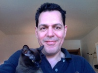
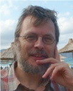
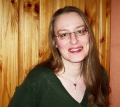

# The developers and supporters of smartmontools 

### Bruce Allen (Initiator and Project Leader) 
I am a professor of physics at the U. of Wisconsin - Milwaukee, and a Director of the Albert Einstein
Institute in Hannover, which is operated by the Max Planck Gesellschaft and Leibniz University Hannover.

I got interested in SMART because of my research work.  I work on data analysis
for gravitational waves (the LIGO, GEO and VIRGO detectors) and my research groups build and operate
large computer clusters for this purpose.
My research group at the Albert Einstein Institute in Hannover operates a cluster with
2400 disks (the Atlas Cluster) and 1100 TB of storage. My research group at U. Wisconsin - Milwaukee 
runs a [beowulf cluster](http://www.lsc-group.phys.uwm.edu/beowulf/nemo/) 
with 1200 (SATA-II) distributed disks attached to hardware RAID controllers.  
We have more than 300 TB disk space on that system. 
It's nice to have advanced warning when a disk is going to fail.

Smartmontools is the only open-source software project that I manage. When smartmontools first started in 2002,
I did most of the coding and real work.  I was lucky to quickly find several other developers like Doug Gilbert and
Christian Franke who knew much more than I did!  These days I mostly do coordination and cheerleading - 
in any given technical area there are typically other developers who know more than I do.

I also do some work on BOINC, and run the Einstein@Home distributed search for gravitational waves.

---

### Christian Franke (Project Manager, Developer and Maintainer) 

My interest in hard disk monitoring actually starts when the disk of the christmas-gift-PC for
my son failed in the evening of Dec. 23, 2003. This resulted in a first Windows port of smartctl checked
in on Feb. 23, 2004. Future plan for smartmontools is a major redesign of smartd and the internal device
interface, which benefits from the transition from C to C++.

My other open source contributions include some small patches for Cygwin and Mozilla.org
(Firefox/Thunderbird/SeaMonkey and Bugzilla) codebase, a Windows port of hdparm, and a recent Cygwin port
of GRUB2.

In real life, I hold a degree in computer science and work for a company developing applications for
banking & finance.

---

### Guido Guenther (Developer) 
Guido has a sharp eye for distribution issues and clean system architecture.
He improved Makefiles, configuration and installation scripts, cared for packaging
issues and made sure that `Return Values` were correct. 
Last not least, he added CCISS (Compaq Smart Array Controller) support with 
contributions from Praveen Chidambaram, Douglas Gilbert and Frederic Boiteux.

---

### Gabriele Pohl (Sysadmin and Team Assistant) 

I joined Smartmontools developer team in May 2008 to rebuilt the 
old homepage
to a multipage (but even static) website.
This was a first larval stage. Inbetween we moved to a more collaborative space with Trac and Wiki, so every one can participate in an active manner.
Contributions are welcome!

In July 2009 I moved the sourcecode repository from CVS to Subversion for better integration in TRAC (Tickets, Wiki). 
Thanks to Christian, we got more [advantages](releasepolicy.md) 
from the change, e.g. if built from trunk, the first line of Smartmontools output 
reports the SVN revision date and number. So if you send smartctl output, we can now identify the exact revision :-) 

At the time I am moderator of [developers mailing list](https://listi.jpberlin.de/mailman/listinfo/smartmontools-devel) 
and (together with Alex Samorukov) take care of our own project internet server (which hosts the Trac Wiki you are browsing just now ;) 
and the project facilities at sourceforge.

  

---

### Alexander Shaduri (Developer of GSmartControl) 

A few years ago I felt that I wanted to contribute something
to the open source community, being a heavy user of all the
open source software out there. I started looking for areas that
needed some work and found that there were no user-friendly
HDD health inspection tools for the Linux desktop users. A few months
later [GSmartControl](http://gsmartcontrol.berlios.de/) was born. 
Because of excellent portability of smartmontools, 
GSmartControl was very easy to [port to a myriad of operating systems](download.md#Installprecompiledpackage) 
I never even used before.

Thanks to the friendly community of smartmontools developers,
the relationship between smartmontools and GSmartControl is
progressing nicely. My wishes for the future of smartmontools
would be a solid API, even better support for various controllers
and drives (although it's already excellent), and of course, more
user data saved thanks to the early detection of future failures. :)

---

### Other portraits 

will follow..
